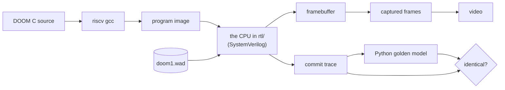

# DOOM on a CPU I designed

[](https://github.com/IbrahimA146/rv32im-riscv-soc/actions/workflows/ci.yml)


DOOM, running on a RISC-V processor I built from scratch in SystemVerilog. Every pixel above was rendered by
the five-stage pipeline in [`rtl/`](rtl/), executing compiled C, and captured from its framebuffer. No
emulator stands in for the CPU — the RTL itself executes all 532 million instructions.

| | |
|---|---|
| **The chip** | RV32IM + Zicsr, 5-stage pipeline, forwarding, load-use interlocks, BTB + bimodal branch prediction, iterative divider, precise exceptions and interrupts |
| **The system** | RAM, UART, timer/CLINT, GPIO, 320×200 indexed-colour framebuffer, keyboard queue, bus-fault detection |
| **The software** | bare-metal C, own `crt0` and trap handler, newlib retargeted onto the SoC, then DOOM itself |
| **DOOM** | **1.51 M cycles per frame**, CPI **1.165**, branch prediction **90.7 %** over 532 M instructions |
| **Verification** | 64 tests, every instruction cross-checked against a golden model, **26/26 injected bugs caught** |

**At the SoC's 50 MHz design clock, 1.51 M cycles per frame works out to ~33 fps.** That is a projection from
measured cycle counts, not a measurement on silicon: this design has never been synthesized to an FPGA. What
is measured is the cycle count, and it is measured on the real RTL.

---

## How a game ends up running on a CPU that didn't exist



DOOM is compiled for the instruction set this CPU implements, loaded into its memory, and executed one
instruction at a time by the pipeline. When the game writes a pixel, that is a store instruction travelling
through MEM into the framebuffer. The same run also emits a trace of every committed instruction, which is
compared against an independent Python model of the ISA — so correctness is checked on the exact run that
produced the picture.

| Folder | What it is |
|---|---|
| [`rtl/core/`](rtl/core) | The processor: pipeline, decoder, ALU, multiplier, divider, CSRs, branch predictor |
| [`rtl/soc/`](rtl/soc) | Everything around it: memory, UART, timer, GPIO, video, keyboard |
| [`fw/`](fw) | Startup code, drivers, newlib retargeting, and the DOOM platform layer |
| [`sim/`](sim) | Two harnesses: a SystemVerilog testbench and a C++ one for speed |
| [`tests/`](tests) `scripts/` | The golden model, the test suites, and the mutation tester |

## Verification

The part I would most want to be asked about.

* **Differential co-simulation.** Every ISA and random test runs on the RTL *and* on a Python model of the
  instruction set, and the two commit traces must match instruction by instruction. A mismatch names the
  exact instruction where they diverged.
* **Two independent simulators.** `--sim=both` runs everything under Verilator and Icarus Verilog. Traces and
  captured frames are identical between them.
* **~5,800 generated directed vectors** covering every opcode against edge-case operands, plus hand-written
  tests for traps, interrupts, CSRs and pipeline hazards, plus a constrained-random program generator.
* **Mutation testing.** 26 realistic bugs are injected into copies of the RTL one at a time; the suite must
  catch every one. It does. The first run left three alive, which exposed real gaps in the tests — those gaps
  are now closed.

Five bugs this flow caught are written up in [docs/verification.md](docs/verification.md), including a
multiply that silently truncated to 33 bits and an interrupt livelock that could stall a divide forever.

Every push runs the co-simulated ISA and random suites plus all 26 mutants on a clean Ubuntu machine. The
firmware suites are informational there: they need a RISC-V toolchain that ships an rv32 C library, and how
to link one differs between toolchains. Nothing the CPU itself is judged on depends on that.

## Run it

Needs Icarus Verilog, Verilator, a RISC-V GCC and Python 3 ([setup](docs/getting-started.md)).

```bash
python scripts/run_tests.py          # the whole suite, ~8 s
python scripts/mutation_test.py      # break the chip 26 ways, confirm the tests notice
python scripts/fetch_doom.py         # DOOM source + shareware WAD into external/
python scripts/build_doom.py --frames 400 --doom-args="-timedemo demo1" --video
```

The last line builds DOOM for this CPU, runs it on the RTL, saves every frame and encodes the video. It takes
about two minutes for 400 frames — simulation runs at roughly 6 M cycles/s, about 4 frames per second.

## What this is and isn't

* The CPU, SoC, firmware, testbench, golden model and verification flow are mine. DOOM is id Software's,
  via [doomgeneric](https://github.com/ozkl/doomgeneric); the WAD is the freely redistributable shareware
  episode. Neither is committed here — `fetch_doom.py` downloads them.
* It runs **in simulation**. Nothing here has been synthesized, placed, routed or timed on an FPGA, so the
  50 MHz figure is a design target, not a measured maximum frequency.
* No sound (the SoC has no audio device), no U-mode, PMP or compressed instructions.

## Docs

* [Getting started](docs/getting-started.md) — what each command does, in plain language
* [Architecture](docs/architecture.md) — pipeline, hazards, memory map, design decisions
* [Verification](docs/verification.md) — co-simulation, random tests, mutation testing, bugs found
* [Plan](docs/plan.md) — the staged route to DOOM, with measurements at each step
