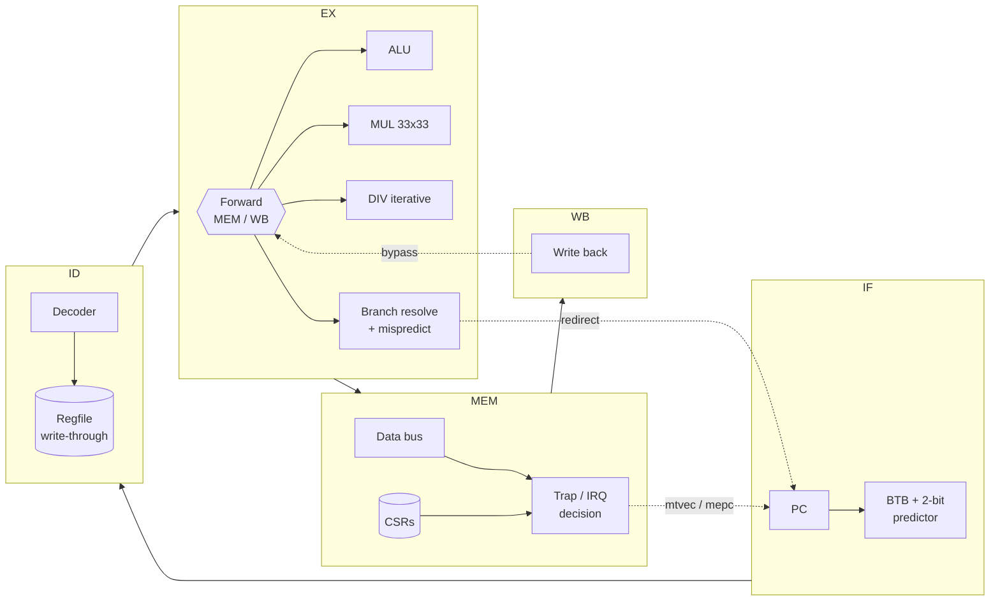
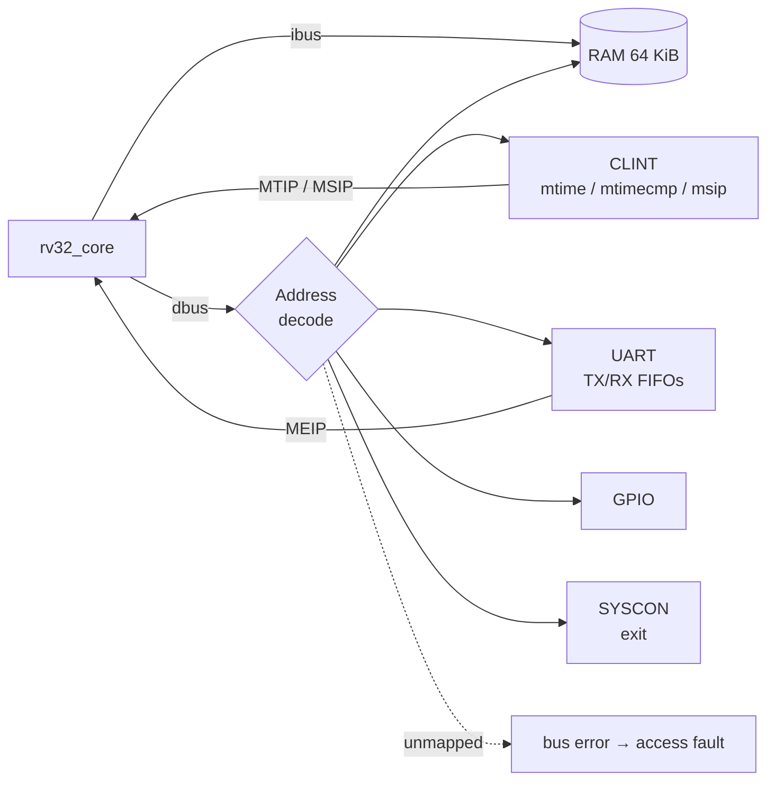
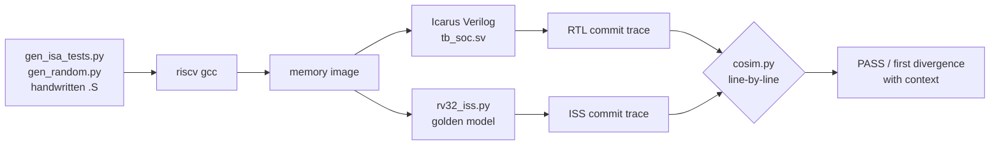

# RV32IM Pipelined RISC-V SoC — RTL to Bare-Metal Firmware

A from-scratch **5-stage pipelined RISC-V processor** (RV32IM + Zicsr) in SystemVerilog, integrated into a
microcontroller-class **SoC** (UART, timer, GPIO), running **bare-metal C firmware** that reports its own
cycle-accurate performance through hardware counters. It is verified with **differential co-simulation against
a golden reference model**, **constrained-random program generation**, and **mutation testing**, which checks
that the tests really do catch bugs.

```
==================================================
  RV32IM SoC  |  5-stage pipeline  |  bare metal
==================================================
  misa     0x40001100  (RV32IM)
  hartid   0

Self-test / benchmark
  crc32            PASS    12929 insns  CPI 1.197  bpred  70%
  sieve            PASS   116460 insns  CPI 1.088  bpred  97%
  quicksort        PASS    44158 insns  CPI 1.133  bpred  70%
  matmul           PASS    35121 insns  CPI 1.020  bpred  93%
  div/rem          PASS     3001 insns  CPI 5.876  bpred  96%
  ecall            PASS      194 insns  CPI 1.314  bpred  21%
  illegal-insn     PASS      191 insns  CPI 1.277  bpred  44%

Timer interrupts -> GPIO
    tick  1  leds .......*
    tick  2  leds ......*.
    tick  3  leds .....*..
  ...
UART shell ready (type 'help')
> stats
  mcycle        395265
  minstret      322873
  CPI           1.224
  branches      104944 (14242 mispredicted, 86% accuracy)
  irqs          timer=15 uart=16 soft=0
> exit
  bye
```
<sub>That is real output. The firmware runs on the simulated RTL, the text is decoded bit by bit from the SoC's UART
TX pin, and the commands are typed into its RX pin by the testbench.</sub>

---

## Highlights

| | |
|---|---|
| **CPU** | RV32IM_Zicsr, 5-stage pipeline, full forwarding, load-use stalls, BTB + 2-bit bimodal predictor, iterative divider, precise exceptions & interrupts, vectored `mtvec`, 64-bit `mcycle`/`minstret`, branch/mispredict HPM counters |
| **SoC** | 64 KiB RAM, SiFive-compatible CLINT, 8N1 UART with 16-deep FIFOs + IRQ, 32-bit GPIO, bus-error → precise access-fault |
| **Firmware** | Own `crt0`, linker script, trap vector with C dispatcher, IRQ-driven UART ring buffer, `printf`, timer driver, ecall "syscalls", illegal-instruction recovery, interactive shell |
| **Verification** | ~5,800 generated directed vectors plus 7 handwritten test programs, **commit-trace co-simulation against a Python ISS**, constrained-random program generator, **mutation testing (26 injected RTL bugs, all caught)** |
| **Results** | CPI **1.02–1.20** on integer workloads, **86–97 %** branch-prediction accuracy, **0** mismatches across 450k+ verified instructions per regression |

---

## Architecture

### Pipeline



| Event | Detected in | Action |
|---|---|---|
| Operand produced by instruction in MEM / WB | EX | Forward (MEM has priority over WB); regfile write-through covers WB→ID |
| Load result needed by next instruction | ID | Stall PC + IF/ID one cycle, bubble into EX |
| DIV/REM in progress | EX | Hold PC, IF/ID, ID/EX; bubble into MEM (~34 cycles) |
| Wrong direction **or** wrong target | EX | Flush IF/ID + ID/EX, redirect PC, train BTB |
| Exception / interrupt / MRET | MEM | Flush IF/ID, ID/EX, EX/MEM (and the trapping instruction), redirect to `mtvec` / `mepc` |

Everything that changes architectural state (register writes, memory writes, CSR writes, counters) happens
at or after **MEM**, so a flushed instruction can never leave a trace. That property is what makes exceptions
and interrupts precise.

### SoC



| Base | Device | Registers |
|---|---|---|
| `0x0000_0000` | RAM (64 KiB) | code, data, stack |
| `0x0200_0000` | CLINT | `msip` +0x0, `mtimecmp` +0x4000, `mtime` +0xBFF8 |
| `0x1000_0000` | UART | `TXDATA` `RXDATA` `STATUS` `CTRL` `BAUDDIV` |
| `0x2000_0000` | GPIO | `OUT` `IN` `OE` |
| `0x3000_0000` | SYSCON | `EXIT` (write ends simulation with a code) |

Implemented CSRs: `mstatus misa mie mtvec mscratch mepc mcause mtval mip mcycle[h] minstret[h]
mhpmcounter3` (resolved branches), `mhpmcounter4` (mispredictions), `mvendorid marchid mimpid mhartid`.
Unknown CSRs and writes to read-only CSRs raise illegal-instruction.

---

## Verification



**1. Differential co-simulation.** The testbench logs every committed instruction in WB as
`pc, insn, rd←value` or `pc, insn, mem[addr]←data`. An independent Python instruction-set simulator runs the same image and
produces the same trace. Any mismatch (a value, a missing or extra commit, a wrong trap) is reported at the
exact instruction:

```
MISMATCH at commit #118:
        116  000001a4 40695c93 x25 00000000
        117  000001a8 fff1f213 x4 b9b81000
  >     118  ISS: 000001ac e99f9e23 mem 0000be9c 00000000
  >     118  RTL: 000001ac e99f9e23 mem 0000be9c 00001d03
```

**2. Directed tests** (`tests/isa/`)
* `generated/*.S`: every R/I-type and M-extension opcode against edge-case operands (`0`, `-1`, `INT_MIN`,
  `INT_MIN/-1`, divide by zero, …) plus source/destination bypass variants at 0/1/2-instruction distances,
  which exercises every forwarding path. Expected values come from a separate Python model.
* `jumps.S` `memory.S` `csr.S` `traps.S` `misc.S`: link values, JALR bit-0, byte/half/word sign extension,
  MMIO, CSR WARL fields, CSR value forwarding, every exception cause with `mepc`/`mtval` checks, and a trap
  that aborts a divide in flight.
* `hazards.S`: divide stalls fed by forwarding and by load-use, mispredicts directly followed by stall sources,
  recursive `fib(15)` (call/ret + stack).
* `irq.S` (RTL-only): timer/software interrupts, `MIE` masking, vectored mode, and a **precise-interrupt
  torture test** in which a workload with divides, loads, stores, calls and mispredicts must produce the same checksum
  with a timer interrupt every 37 cycles as with interrupts off.

**3. Constrained-random programs** (`tests/random/gen_random.py`). These programs terminate by construction and are biased
towards dependency chains on recently written registers (forwarding), store→load→use (load-use stalls),
divide→use (EX stalls), bounded loops with data-dependent branches (predictor training and mispredicts), and
JAL/JALR with arbitrary link registers.

**4. Mutation testing** (`scripts/mutation_test.py`). *Who tests the tests?* Each mutant is a realistic
single-line RTL bug compiled from a private copy of the source tree. The suite must make at least one test fail.

**Mutation score: 26/26 killed.**

| Area | Injected bugs | Caught by |
|---|---|---|
| Forwarding / stalls | no MEM→EX fwd, no WB→EX fwd, WB-over-MEM priority, no load-use stall, load-use ignores rs2, no regfile write-through, EX stall doesn't bubble MEM | `misc`, `jumps`, `hazards`, `memory` |
| Control flow | mispredict ignores target, mispredict doesn't squash ID, BGE unsigned, JALR keeps bit 0 | `jumps`, `misc`, random cosim |
| Datapath | SRA logical, SLT unsigned, MULHSU signed rs2, REM sign, divide-by-zero, LBU sign-extends, SH strobe offset | random cosim, `memory`, `misc` |
| Traps / CSRs | MRET doesn't flush, mepc+4, CSR write beats trap, CSRRS x0 writes, MIE ignored, vectored offset, unknown CSR legal, minstret counts traps | `traps`, `csr`, `irq` |

Several of these were **only** caught by co-simulation, not by any self-check. That's the argument for keeping a
golden model.

### Bugs the verification flow found

These are real bugs from development, and they're the part of the project I'd talk through in an interview:

1. **MULH/MULHSU/MULHU returned garbage.** `$unsigned($signed(a) * $signed(b))` looks right, but
   `$unsigned()` makes its argument *self-determined*, so the 33×33 multiply was evaluated at 33 bits and the
   upper half was lost. The generated edge-case vectors caught it at the first failing operand pair. The fix was declaring the
   operands and product `signed` so the 66-bit context extends them.
2. **Interrupt livelock with multi-cycle divides.** The precise-interrupt torture test hung. When a divide (~34 cycles)
   finished and reached MEM, a timer interrupt was already pending again, so the interrupt was taken on the divide, its
   result was thrown away, and it restarted, forever. The fix: a completed divide in MEM is never preempted, and the
   interrupt is taken on the next instruction. That guarantees progress at the cost of one instruction of latency
   ([rv32_core.sv](rtl/core/rv32_core.sv)).
3. **Holes in the test suite (found by mutation testing).** The first mutation run left 3 mutants alive:
   * `minstret` counting trapped instructions → added an exact counter-delta test around an `ecall`.
   * A CSR write racing an interrupt → added a test where a timer fires every 23 cycles into a loop of
     *non-idempotent* `csrrw` swaps.
   * One mutant was **equivalent** (the divider's general path already produces the spec result for `INT_MIN/-1`), so it
     was replaced with a divide-by-zero mutant.

---

## Performance

Measured by the firmware itself from `mcycle` / `minstret` / `mhpmcounter3-4`:

| Workload | Instructions | CPI | Branch prediction |
|---|---:|---:|---:|
| Sieve of Eratosthenes (8192) | 116,460 | 1.088 | 97 % |
| 12×12 matrix multiply (2 loop orders) | 35,121 | 1.020 | 93 % |
| Quicksort (400 × int32) | 44,158 | 1.133 | 70 % |
| CRC-32 (table build + hash) | 12,929 | 1.197 | 70 % |
| Signed/unsigned div/rem identities | 3,001 | 5.876 | 96 % |

The CPI overhead comes from load-use stalls (1 cycle), mispredicts (2 cycles) and divides (~34 cycles, which dominate
`div/rem`). Quicksort's data-dependent comparisons are where a bimodal predictor struggles, as expected.

---

## Getting started

**Tools:** Icarus Verilog ≥ 12, a RISC-V GCC (`riscv64-unknown-elf-gcc`, which covers rv32), Python ≥ 3.9.

```bash
# Ubuntu
sudo apt install iverilog gcc-riscv64-unknown-elf python3
# Windows (MSYS2 UCRT64)
pacman -S mingw-w64-ucrt-x86_64-iverilog mingw-w64-ucrt-x86_64-riscv64-unknown-elf-gcc make
```

```bash
python scripts/run_tests.py            # full regression (~1-2 min)
python scripts/run_tests.py fw -v      # boot the firmware, watch the UART console
python scripts/run_tests.py random -n 200
python scripts/run_tests.py isa -k div # filter
python scripts/mutation_test.py        # mutation score
make wave                              # build/wave.vcd for GTKWave / Surfer
```

Every build writes an objdump listing (`build/**/*.lst`) and, for firmware, a linker map, which makes a failing
trace line quick to map back to source.

---

## Repository layout

```
rtl/core/     rv32_core (pipeline), decoder, alu, mul, div, regfile, csr, bpu, pkg
rtl/soc/      soc_top (interconnect), ram, uart, fifo, clint, gpio
sim/          tb_soc.sv: UART BFM (decode TX / drive RX), commit-trace logger, stats
fw/common/    crt0.S, link.ld, trap dispatcher, uart/timer drivers, printf, CSR helpers
fw/apps/demo/ self-test + benchmark + interrupt demo + UART shell
tests/isa/    test_macros.h, handwritten tests, generated/ (from gen_isa_tests.py)
tests/random/ constrained-random program generator
scripts/      run_tests.py, rv32_iss.py (golden model), cosim.py, mutation_test.py, bin2hex.py
```

---

## Design decisions

* **Resolve branches in EX, take traps in MEM.** Both stages already hold forwarded operands and the final
  memory-access outcome, so everything that can redirect the PC is known without extra comparators in ID.
* **Train the BTB only on taken branches.** Never-taken branches don't evict useful entries; a weakly-taken
  initial state makes loops predict correctly from their second iteration.
* **Iterative divider, single-cycle multiplier.** A 32-level combinational divider would set the critical path;
  multipliers map onto FPGA DSP blocks. Divide-by-zero finishes in one cycle.
* **Data-bus errors depend on the address only.** `dbus_err → trap → dbus_we` would otherwise form a
  combinational loop. Writes are also gated off for faulting addresses.
* **Harvard access, one memory map.** Separate instruction and data ports on shared RAM avoid a fetch/load
  arbitration stall while keeping `.rodata` directly readable.

## Limitations and next steps

* Memory reads are asynchronous (LUT-RAM style). Moving to synchronous BRAM would need a registered fetch
  or an extra pipeline stage.
* Not yet synthesized or timed on an FPGA. Next steps are a Yosys/nextpnr flow for an iCE40/ECP5 board plus a
  Verilator lint and a faster simulation target.
* Formal verification with `riscv-formal` (RVFI) would complement the dynamic checks. The WB commit fields
  already carry most of the RVFI signals.
* The ISS does not model asynchronous interrupts, so interrupt tests self-check on the RTL instead of being
  co-simulated.
* M-mode only: no U-mode, PMP or C extension.
