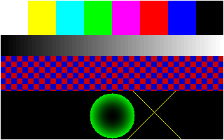

# DOOM on a CPU I designed

A RISC-V processor built from scratch, the small computer around it, and the firmware that runs on it,
now being extended until it plays DOOM — on the real RTL, in simulation, recorded as a video.

## Where it stands

* **Working today:** the CPU, the system-on-chip, bare-metal firmware, and a verification flow that checks
  every instruction against a reference model.
* **In progress:** the DOOM port. Groundwork done (Verilator brought the simulator from ~10 k to 1.63 M
  cycles/s, a 170x speedup on the same RTL). **Stage 1 done:** the chip now has a screen and a keyboard.
  Stage 2 (the fast harness) is next.



*Every pixel above was written one byte at a time by the CPU in `rtl/`, running compiled C, and captured
from the framebuffer by the testbench.*

## The pieces

| Folder | What it is | State |
|---|---|---|
| `rtl/` | **The chip.** A 5-stage pipelined RV32IM CPU plus timer, serial port, GPIO, framebuffer and keyboard. | working |
| `fw/` | **The program.** C firmware that boots the chip and runs on it. | working |
| `tests/` `scripts/` `sim/` | **The proof.** Test programs, a reference model, and the tools that compare them. | working |
| `model/` | **The fast model.** The same CPU in C, quick enough to run a game. | stage 2 |
| `fw/apps/doom/` | **The game.** DOOM ported to the chip. | stage 3 |
| `web/` | **The page.** The model in a browser, with the live CPU panel. | stages 4–5 |

## Roadmap

| # | Stage | You can see | |
|---|---|---|---|
| 1 | Screen, keys, memory | a test pattern drawn by the chip | **done** |
| 2 | Fast harness | the whole regression in seconds | next |
| 3 | C library | malloc/printf/qsort working on the chip | |
| 4 | DOOM port | the title screen, rendered by the pipeline | |
| 5 | Video | DOOM running, as an mp4 in the README | |
| 6 | Browser (stretch) | DOOM playable in a tab, live CPU panel | |

Details, measurements and the "done when" check for each stage are in [docs/plan.md](docs/plan.md).

## Run it

Needs Icarus Verilog, a RISC-V GCC and Python 3 ([setup](docs/getting-started.md)).

```bash
python scripts/run_tests.py fw -v     # boot the chip, watch its console, draw a frame
python scripts/run_tests.py           # every test, checked against the reference model
python scripts/mutation_test.py       # break the chip 26 ways, confirm the tests notice
```

## Read more

* [Getting started](docs/getting-started.md) — what each command shows, in plain language
* [Architecture](docs/architecture.md) — pipeline, memory map, performance, design decisions
* [Verification](docs/verification.md) — co-simulation, random tests, mutation testing, bugs found
* [Plan](docs/plan.md) — the six DOOM stages
