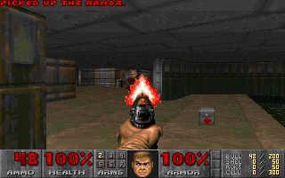
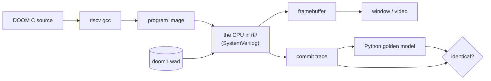

# DOOM on a CPU I designed

[](https://github.com/IbrahimA146/rv32im-riscv-soc/actions/workflows/ci.yml)



I designed a RISC-V processor from scratch in SystemVerilog, built a small computer around it, and DOOM runs
on it — playable, with a keyboard. Every pixel above was produced by the pipeline in [`rtl/`](rtl/)
executing compiled C. No emulator stands in for the CPU.

---

## Play it

**Windows: double-click `play.bat`.** That is the whole thing.

Or from a terminal, on any system:

```bash
python scripts/fetch_doom.py           # one-time: DOOM's source + free game data
python scripts/build_doom.py --play
```

The first run spends a few minutes building; after that it starts in seconds.

| Key | Does |
|---|---|
| Arrow keys | move and turn |
| Ctrl | fire |
| Space | open doors, use switches |
| Alt + arrows | sidestep |
| Esc | menu (screen size, detail, controls) |

### Watching the hardware while you play

The console next to the game prints what the processor is doing, once a second:

```
  8.6 fps |  3.7 M cycles/s |  428098 cycles/frame | CPI 1.08 | branch  84.9% | stalls: load-use  1.6% divide  2.5%
```

Those are not estimates. The CPU counts the events itself in hardware performance counters
(`mhpmcounter3-6`: branches, mispredictions, load-use stall cycles, divider stall cycles), exactly as a real
processor does, and the window title shows the same figures. Watch the branch-prediction accuracy drop when
the view fills with enemies, or the divider stalls climb when the renderer is working hardest.

It runs at **7–12 frames per second**, because your laptop has to imitate every wire of the chip. The design
itself is not the slow part: full-screen frames cost 1.33 M cycles, so at the 50 MHz this SoC is designed for
the same code would run at **~35 fps** — a projection from measured cycle counts, since the design has been
simulated rather than built on an FPGA.

**What you need first** (all free): Python 3, plus these from [MSYS2](https://www.msys2.org/) — every tool is
listed, with removal instructions, in [CLEANUP.md](CLEANUP.md):

```bash
pacman -S mingw-w64-ucrt-x86_64-riscv64-unknown-elf-gcc mingw-w64-ucrt-x86_64-verilator mingw-w64-ucrt-x86_64-iverilog mingw-w64-ucrt-x86_64-SDL2 make
```

## Or just run the tests

```bash
python scripts/run_tests.py       # the whole suite, about 8 seconds
python scripts/mutation_test.py   # break the chip 26 ways, confirm the tests notice
```

---

## What it is

| | |
|---|---|
| **The chip** | RV32IM + Zicsr, 5-stage pipeline, forwarding, load-use interlocks, BTB + bimodal branch prediction, iterative divider, precise exceptions and interrupts |
| **The system** | RAM, UART, timer/CLINT, GPIO, 320×200 indexed-colour framebuffer, keyboard queue, bus-fault detection |
| **The software** | bare-metal C, own `crt0` and trap handler, newlib retargeted onto the SoC, then DOOM itself |
| **DOOM** | 1.33 M cycles per frame full-screen, CPI **1.165**, branch prediction **90.7 %** over 532 M instructions |
| **Verification** | 64 tests, every instruction cross-checked against a golden model, **26/26 injected bugs caught** |



DOOM is compiled for the instruction set this CPU implements, loaded into its memory, and executed one
instruction at a time by the pipeline. When the game writes a pixel, that is a store instruction travelling
through the memory stage into the framebuffer. The same run emits a trace of every committed instruction,
compared against an independent Python model of the ISA — so correctness is checked on the exact run that
draws the picture.

| Folder | What it is |
|---|---|
| [`rtl/core/`](rtl/core) | The processor: pipeline, decoder, ALU, multiplier, divider, CSRs, branch predictor |
| [`rtl/soc/`](rtl/soc) | Everything around it: memory, UART, timer, GPIO, video, keyboard |
| [`fw/`](fw) | Startup code, drivers, newlib retargeting, and the DOOM platform layer |
| [`sim/`](sim) | Two harnesses: a SystemVerilog testbench, and a C++ one for speed and live play |
| [`tests/`](tests) `scripts/` | The golden model, the test suites, the mutation tester and the profiler |

## Verification

The part I would most want to be asked about.

* **Differential co-simulation.** Every ISA and random test runs on the RTL *and* on a Python model of the
  instruction set; the two commit traces must match instruction by instruction, and a mismatch names the
  exact instruction where they diverged.
* **Two independent simulators.** `--sim=both` runs everything under Verilator and Icarus Verilog. Traces
  and captured frames are identical between them.
* **~5,800 generated directed vectors** covering every opcode against edge-case operands, plus hand-written
  tests for traps, interrupts, CSRs and pipeline hazards, plus a constrained-random program generator.
* **Mutation testing.** 26 realistic bugs are injected into copies of the RTL one at a time; the suite must
  catch every one. It does. The first run left three alive, which exposed real gaps in the tests.

Six bugs this flow caught are written up in [docs/verification.md](docs/verification.md), including a
multiply that silently truncated to 33 bits and an interrupt livelock that could stall a divide forever.

Every push re-runs the co-simulated suites and all 26 mutants on a clean Ubuntu machine.

DOOM itself is id Software's, via [doomgeneric](https://github.com/ozkl/doomgeneric), and the game data is
the freely redistributable shareware episode; `fetch_doom.py` downloads both. There is no sound, because the
SoC has no audio device.

## Docs

* [Getting started](docs/getting-started.md) — what each command shows, in plain language
* [Architecture](docs/architecture.md) — pipeline, hazards, memory map, design decisions
* [Verification](docs/verification.md) — co-simulation, random tests, mutation testing, bugs found
* [Plan](docs/plan.md) — the staged route to DOOM, with measurements at each step
* [Cleanup](CLEANUP.md) — every tool installed and file downloaded, and how to remove them
