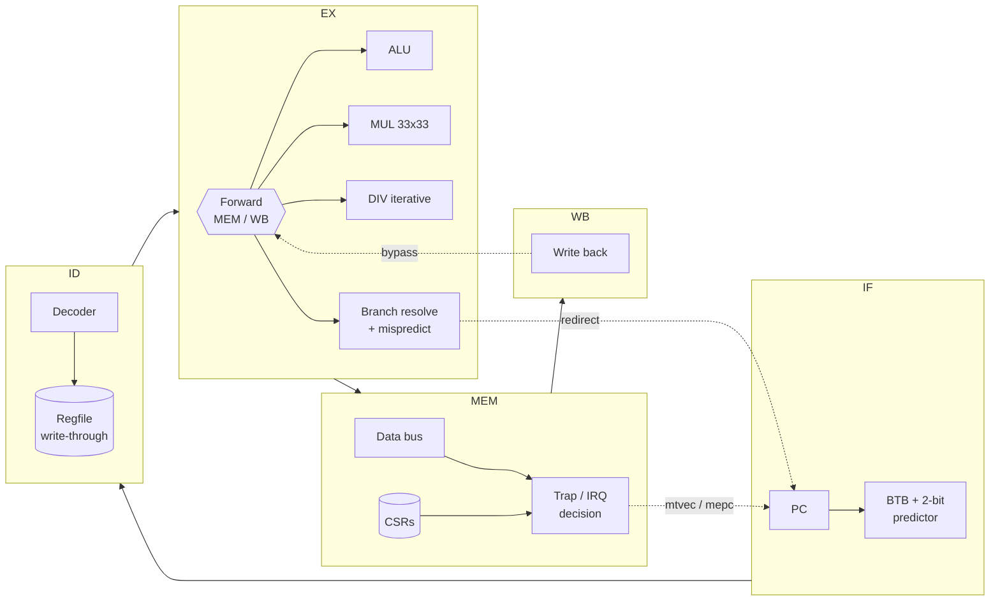
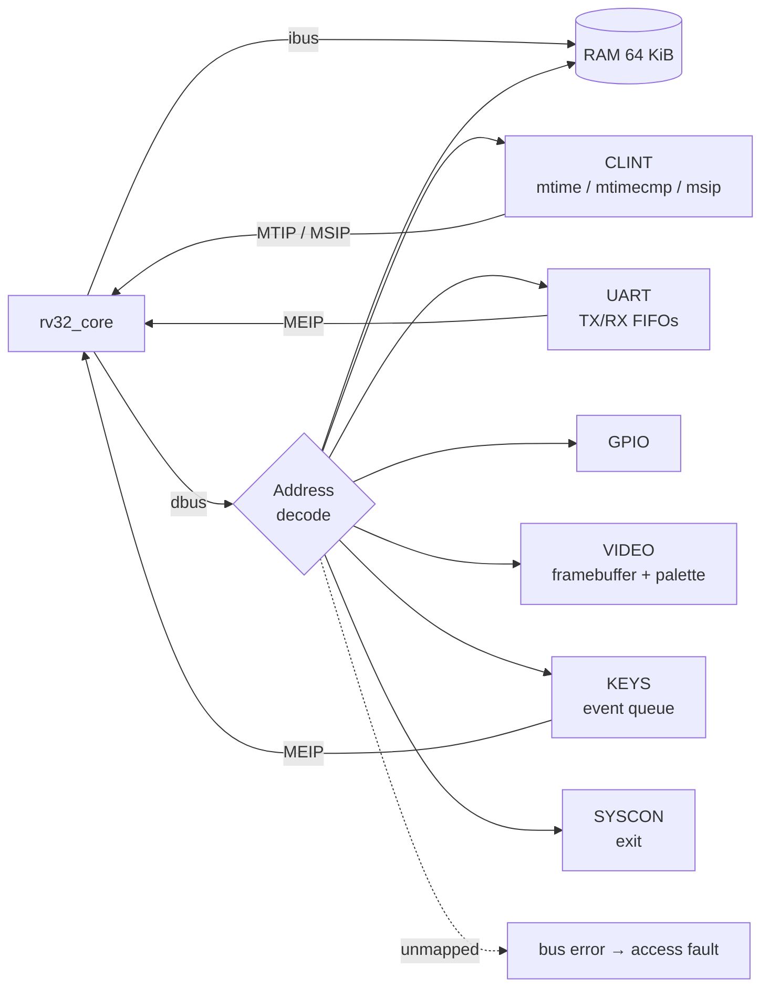

# Architecture

How the CPU and the system-on-chip around it are built. For the test strategy see
[verification.md](verification.md).

## At a glance

| | |
|---|---|
| **CPU** | RV32IM_Zicsr, 5-stage pipeline, full forwarding, load-use stalls, BTB + 2-bit bimodal predictor, iterative divider, precise exceptions & interrupts, vectored `mtvec`, 64-bit `mcycle`/`minstret`, branch/mispredict HPM counters |
| **SoC** | RAM (64 KiB for tests, parameterised up to 16 MiB), SiFive-compatible CLINT, 8N1 UART with 16-deep FIFOs + IRQ, 32-bit GPIO, 320x200 indexed-colour framebuffer, keyboard event queue, bus-error → precise access-fault |
| **Firmware** | Own `crt0`, linker script, trap vector with C dispatcher, IRQ-driven UART ring buffer, `printf`, timer driver, ecall "syscalls", illegal-instruction recovery, interactive shell |

## Pipeline



| Event | Detected in | Action |
|---|---|---|
| Operand produced by instruction in MEM / WB | EX | Forward (MEM has priority over WB); regfile write-through covers WB→ID |
| Load result needed by next instruction | ID | Stall PC + IF/ID one cycle, bubble into EX |
| DIV/REM in progress | EX | Hold PC, IF/ID, ID/EX; bubble into MEM (~34 cycles) |
| Wrong direction **or** wrong target | EX | Flush IF/ID + ID/EX, redirect PC, train BTB |
| Exception / interrupt / MRET | MEM | Flush IF/ID, ID/EX, EX/MEM (and the trapping instruction), redirect to `mtvec` / `mepc` |

Everything that changes architectural state (register writes, memory writes, CSR writes, counters) happens
at or after **MEM**, so a flushed instruction can never leave a trace. That property is what makes exceptions
and interrupts precise.

## SoC



| Base | Device | Registers |
|---|---|---|
| `0x0000_0000` | RAM (64 KiB) | code, data, stack |
| `0x0200_0000` | CLINT | `msip` +0x0, `mtimecmp` +0x4000, `mtime` +0xBFF8 |
| `0x1000_0000` | UART | `TXDATA` `RXDATA` `STATUS` `CTRL` `BAUDDIV` |
| `0x2000_0000` | GPIO | `OUT` `IN` `OE` |
| `0x3000_0000` | SYSCON | `EXIT` (write ends simulation with a code) |
| `0x4000_0000` | VIDEO pixels | 320x200 colour indices, one byte per pixel |
| `0x4001_0000` | VIDEO palette | 256 x `0x00RRGGBB`, grayscale ramp on reset |
| `0x4002_0000` | VIDEO control | `PRESENT` (write: frame done) `FRAME` `MODE` |
| `0x5000_0000` | KEYS | `DATA` (read pops) `STATUS` `CTRL`, IRQ into MEIP |

Implemented CSRs: `mstatus misa mie mtvec mscratch mepc mcause mtval mip mcycle[h] minstret[h]
mhpmcounter3` (resolved branches), `mhpmcounter4` (mispredictions), `mvendorid marchid mimpid mhartid`.
Unknown CSRs and writes to read-only CSRs raise illegal-instruction.

## Performance

Measured by the firmware itself from `mcycle` / `minstret` / `mhpmcounter3-4`:

| Workload | Instructions | CPI | Branch prediction |
|---|---:|---:|---:|
| Sieve of Eratosthenes (8192) | 116,460 | 1.088 | 97 % |
| 12×12 matrix multiply (2 loop orders) | 35,121 | 1.020 | 93 % |
| Quicksort (400 × int32) | 44,158 | 1.133 | 70 % |
| CRC-32 (table build + hash) | 12,929 | 1.197 | 70 % |
| Signed/unsigned div/rem identities | 3,001 | 5.876 | 96 % |

The CPI overhead comes from load-use stalls (1 cycle), mispredicts (2 cycles) and divides (~34 cycles, which dominate
`div/rem`). Quicksort's data-dependent comparisons are where a bimodal predictor struggles, as expected.

## Design decisions

* **Resolve branches in EX, take traps in MEM.** Both stages already hold forwarded operands and the final
  memory-access outcome, so everything that can redirect the PC is known without extra comparators in ID.
* **Train the BTB only on taken branches.** Never-taken branches don't evict useful entries; a weakly-taken
  initial state makes loops predict correctly from their second iteration.
* **Iterative divider, single-cycle multiplier.** A 32-level combinational divider would set the critical path;
  multipliers map onto FPGA DSP blocks. Divide-by-zero finishes in one cycle.
* **Data-bus errors depend on the address only.** `dbus_err → trap → dbus_we` would otherwise form a
  combinational loop. Writes are also gated off for faulting addresses.
* **Harvard access, one memory map.** Separate instruction and data ports on shared RAM avoid a fetch/load
  arbitration stall while keeping `.rodata` directly readable.

## Limitations

* Memory reads are asynchronous (LUT-RAM style). Moving to synchronous BRAM would need a registered fetch
  or an extra pipeline stage.
* Not yet synthesized or timed on an FPGA. Next steps there are a Yosys/nextpnr flow for an iCE40/ECP5 board plus a
  Verilator lint and a faster simulation target.
* Formal verification with `riscv-formal` (RVFI) would complement the dynamic checks. The WB commit fields
  already carry most of the RVFI signals.
* The ISS does not model asynchronous interrupts, so interrupt tests self-check on the RTL instead of being
  co-simulated.
* M-mode only: no U-mode, PMP or C extension.

## Where the code lives

```
rtl/core/     rv32_core (pipeline), decoder, alu, mul, div, regfile, csr, bpu, pkg
rtl/soc/      soc_top (interconnect), ram, uart, fifo, clint, gpio
sim/          tb_soc.sv: UART BFM (decode TX / drive RX), commit-trace logger, stats
fw/common/    crt0.S, link.ld, trap dispatcher, uart/timer drivers, printf, CSR helpers
fw/apps/demo/ self-test + benchmark + interrupt demo + UART shell
tests/isa/    test_macros.h, handwritten tests, generated/ (from gen_isa_tests.py)
tests/random/ constrained-random program generator
scripts/      run_tests.py, rv32_iss.py (golden model), cosim.py, mutation_test.py, bin2hex.py
```
