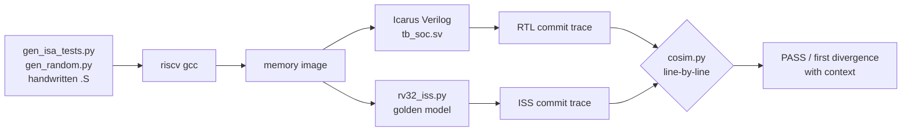

# Verification

How we know the CPU is correct. For the design itself see [architecture.md](architecture.md).

| | |
|---|---|
| **Tests** | ~5,800 generated directed vectors plus 7 handwritten test programs, **commit-trace co-simulation against a Python ISS**, constrained-random program generator, **mutation testing (26 injected RTL bugs, all caught)** |
| **Results** | CPI **1.02–1.20** on integer workloads, **86–97 %** branch-prediction accuracy, **0** mismatches across 450k+ verified instructions per regression |

## The flow



## 1. Differential co-simulation

The testbench logs every committed instruction in WB as
`pc, insn, rd←value` or `pc, insn, mem[addr]←data`. An independent Python instruction-set simulator runs the same image and
produces the same trace. Any mismatch (a value, a missing or extra commit, a wrong trap) is reported at the
exact instruction:

```
MISMATCH at commit #118:
        116  000001a4 40695c93 x25 00000000
        117  000001a8 fff1f213 x4 b9b81000
  >     118  ISS: 000001ac e99f9e23 mem 0000be9c 00000000
  >     118  RTL: 000001ac e99f9e23 mem 0000be9c 00001d03
```

## 2. Directed tests (`tests/isa/`)

* `generated/*.S`: every R/I-type and M-extension opcode against edge-case operands (`0`, `-1`, `INT_MIN`,
  `INT_MIN/-1`, divide by zero, …) plus source/destination bypass variants at 0/1/2-instruction distances,
  which exercises every forwarding path. Expected values come from a separate Python model.
* `jumps.S` `memory.S` `csr.S` `traps.S` `misc.S`: link values, JALR bit-0, byte/half/word sign extension,
  MMIO, CSR WARL fields, CSR value forwarding, every exception cause with `mepc`/`mtval` checks, and a trap
  that aborts a divide in flight.
* `hazards.S`: divide stalls fed by forwarding and by load-use, mispredicts directly followed by stall sources,
  recursive `fib(15)` (call/ret + stack).
* `irq.S` (RTL-only): timer/software interrupts, `MIE` masking, vectored mode, and a **precise-interrupt
  torture test** in which a workload with divides, loads, stores, calls and mispredicts must produce the same checksum
  with a timer interrupt every 37 cycles as with interrupts off.

## 3. Constrained-random programs (`tests/random/gen_random.py`)

These programs terminate by construction and are biased
towards dependency chains on recently written registers (forwarding), store→load→use (load-use stalls),
divide→use (EX stalls), bounded loops with data-dependent branches (predictor training and mispredicts), and
JAL/JALR with arbitrary link registers.

## 4. Mutation testing (`scripts/mutation_test.py`)

*Who tests the tests?* Each mutant is a realistic
single-line RTL bug compiled from a private copy of the source tree. The suite must make at least one test fail.

**Mutation score: 26/26 killed.**

| Area | Injected bugs | Caught by |
|---|---|---|
| Forwarding / stalls | no MEM→EX fwd, no WB→EX fwd, WB-over-MEM priority, no load-use stall, load-use ignores rs2, no regfile write-through, EX stall doesn't bubble MEM | `misc`, `jumps`, `hazards`, `memory` |
| Control flow | mispredict ignores target, mispredict doesn't squash ID, BGE unsigned, JALR keeps bit 0 | `jumps`, `misc`, random cosim |
| Datapath | SRA logical, SLT unsigned, MULHSU signed rs2, REM sign, divide-by-zero, LBU sign-extends, SH strobe offset | random cosim, `memory`, `misc` |
| Traps / CSRs | MRET doesn't flush, mepc+4, CSR write beats trap, CSRRS x0 writes, MIE ignored, vectored offset, unknown CSR legal, minstret counts traps | `traps`, `csr`, `irq` |

Several of these were **only** caught by co-simulation, not by any self-check. That's the argument for keeping a
golden model.

## Bugs the verification flow found

These are real bugs from development, and they're the part of the project I'd talk through in an interview:

1. **MULH/MULHSU/MULHU returned garbage.** `$unsigned($signed(a) * $signed(b))` looks right, but
   `$unsigned()` makes its argument *self-determined*, so the 33×33 multiply was evaluated at 33 bits and the
   upper half was lost. The generated edge-case vectors caught it at the first failing operand pair. The fix was declaring the
   operands and product `signed` so the 66-bit context extends them.
2. **Interrupt livelock with multi-cycle divides.** The precise-interrupt torture test hung. When a divide (~34 cycles)
   finished and reached MEM, a timer interrupt was already pending again, so the interrupt was taken on the divide, its
   result was thrown away, and it restarted, forever. The fix: a completed divide in MEM is never preempted, and the
   interrupt is taken on the next instruction. That guarantees progress at the cost of one instruction of latency
   ([rv32_core.sv](../rtl/core/rv32_core.sv)).
3. **A latent memory-map clash, caught by an old test.** Adding the framebuffer at `0x4000_0000` made
   `traps.S` fail: it asserted that a load from that address raises an access fault, which stopped being true
   the moment the address became a real device. The test was right to fail, and was retargeted to an address
   that is still unmapped.
4. **Statistics that overflowed at DOOM scale.** The branch-prediction percentage was computed as
   `correct * 1000 / total` in 32-bit arithmetic. That is fine for a few thousand branches and wrong past
   about four million: a DOOM run reported 22.5 % when the real figure was 90.7 %. Both harnesses now compute
   it in 64-bit. A reminder that instrumentation needs the same scrutiny as the design.
5. **Holes in the test suite (found by mutation testing).** The first mutation run left 3 mutants alive:
   * `minstret` counting trapped instructions → added an exact counter-delta test around an `ecall`.
   * A CSR write racing an interrupt → added a test where a timer fires every 23 cycles into a loop of
     *non-idempotent* `csrrw` swaps.
   * One mutant was **equivalent** (the divider's general path already produces the spec result for `INT_MIN/-1`), so it
     was replaced with a divide-by-zero mutant.
